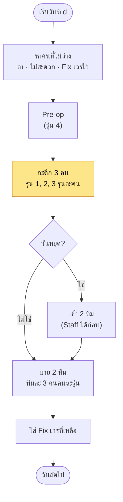
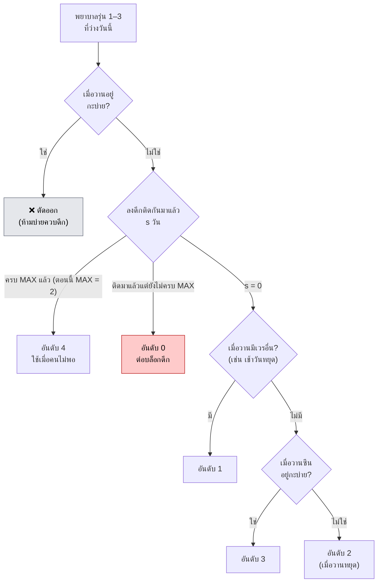
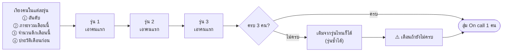
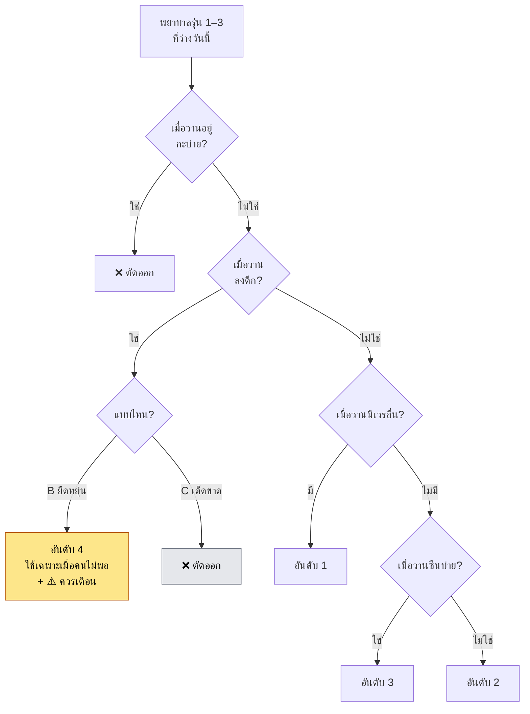
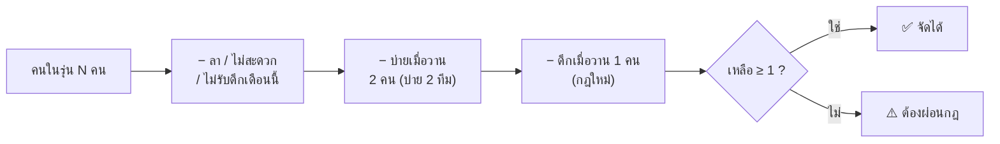

# วิเคราะห์: ปรับกฎเป็น "ดึกห้ามติดกัน"

> วันที่วิเคราะห์ 14 ก.ย. 2569 · ใช้โค้ด `main` ล่าสุด (`lib/domain/autoSchedule.ts`)
> ตัวเลขทั้งหมดมาจากการ**จำลองจัดเวรจริง**ด้วยสำเนาข้อมูลในเครื่อง ไม่ได้แตะเว็บจริงหรือฐานข้อมูลจริง

## สรุป

**ทำได้** และในโค้ดแก้แค่ค่าเดียว (`MAX_NIGHT_STREAK` จาก 2 เป็น 1) บวกข้อความในหน้าจัดเวร ไม่ต้องแก้ฐานข้อมูล

| หัวข้อ | ผลจากการจำลอง ก.ย.–ธ.ค. 2569 ด้วยข้อมูลจริง |
|---|---|
| จัดได้ครบไหม | **ครบทุกวัน** ดึกได้ 3 คนทุกวัน ไม่มีคำเตือน เหมือนตอนนี้ |
| ดึกติดกัน | จาก **≈46 คู่/เดือน → 0** |
| จำนวนดึกของแต่ละคนในรุ่นเดียวกัน | **เท่ากันขึ้นชัดเจน**: ส่วนต่างมากสุด−น้อยสุด จากสูงสุด 4 → 1–2 |
| จำนวนเวรรวมต่อคน | เท่าเดิม (ส่วนต่างในรุ่น 1–2 เวร) |
| สิ่งที่พยาบาลจะรู้สึกต่าง | ดึกกลายเป็นครั้งเดี่ยว ๆ คนละ ≈3–4 ครั้ง/เดือน แทนที่จะเป็น 2 บล็อก (บล็อกละ 2 คืน) |
| รูปแบบใหม่ที่จะเจอ | "ดึกเว้นวัน" (ดึก–ว่าง–ดึก) ≈3 ครั้ง/เดือนทั้งหน่วย และหลังดึก วันถัดไปมีเวรบ่าย/เช้าบ้าง (≈17%) |
| เงื่อนไขที่ต้องมี | ทุกวัน แต่ละรุ่น (1–3) ต้องมีคน**ว่างลงดึกได้อย่างน้อย 4 คน** — ตอนนี้รุ่นที่ตึงสุดมี 6 คน (ก.ย.) |
| ตารางที่จัดไปแล้ว | **ไม่เปลี่ยนเอง** ต้องกดจัดเวรอัตโนมัติใหม่ (ซึ่งเขียนทับทั้งเดือน) |

**แนะนำ:** ใช้แบบ **"ห้ามติด แบบยืดหยุ่น"** (แบบ B ด้านล่าง) และเพิ่มคำเตือนเมื่อระบบจำเป็นต้องให้ดึกติดเพราะคนไม่พอ เริ่มใช้กับเดือนที่ยังไม่ได้จัด (ต.ค. 2569)

---

## 1. ตอนนี้ระบบจัดเวรทีละวันอย่างไร

ระบบวนทีละวันตั้งแต่วันที่ 1 ถึงสิ้นเดือน แต่ละวันเติมกะตามลำดับนี้ **กะดึกถูกจัดก่อนเช้าและบ่าย** จึงได้เลือกคนก่อน



กฎที่เกี่ยวกับกะดึกตอนนี้

| กฎ | ความแรง | ตำแหน่งในโค้ด |
|---|---|---|
| บ่ายเมื่อวาน → ห้ามดึกวันนี้ (บ่ายควบดึก) | **ห้ามเด็ดขาด** | `autoSchedule.ts:141` |
| ดึกติดกันไม่เกิน 2 วัน | อ่อน — ติดวันที่ 3 ได้ถ้าคนไม่พอ | `autoSchedule.ts:34, 142` |
| **ชอบให้ดึกต่อเป็นบล็อก** (ดึกเมื่อวานแล้ว → ให้ต่ออีกคืนก่อน) | จัดลำดับ | `autoSchedule.ts:143` |
| เมื่อวานหยุด → ลงดึกได้ | จัดลำดับ | `autoSchedule.ts:145` |
| วันธรรมดา ดึกกับบ่ายไม่ใช่คนเดียวกัน | เด็ดขาด | `autoSchedule.ts:270` |

---

## 2. ลอจิกเลือกคนลงดึก (ตอนนี้)

แต่ละวัน ทุกคนในรุ่น 1–3 ที่ว่างจะได้ **"อันดับความเหมาะสม"** (เลขน้อย = ได้ก่อน)



จากนั้นเลือกทีมดึก



**ทำไมตอนนี้ดึกมาเป็นคู่:** "อันดับ 0 ต่อบล็อก" มาก่อนเรื่องภาระ ใครลงดึกวันนี้ พรุ่งนี้จะถูกเลือกต่อเกือบแน่นอน
จากการจำลอง ทุกคืนแทบทั้งหมดอยู่ในคู่ (46 คู่/เดือน จาก ≈92 คืน) และ **"ภาระรวม" ถูกใช้เป็นแค่ตัวตัดสินรอง** ทำให้จำนวนดึกในรุ่นเดียวกันห่างกันได้ถึง 4 คืน (บางเดือนมีคนได้ 0 ดึก ขณะที่อีกคนได้ 4)

---

## 3. ถ้าเปลี่ยนเป็น "ห้ามติด" ลอจิกจะเป็นอย่างไร

เปลี่ยน `MAX_NIGHT_STREAK = 1` แล้ว ใครดึกเมื่อวานก็ถือว่า "ครบ MAX" ทันที **อันดับ 0 (ต่อบล็อก) จะหายไปเอง** และคนที่ดึกเมื่อวานจะตกไปอยู่ท้ายสุด



| แบบ | ค่า | คนที่ดึกเมื่อวาน | เมื่อคนไม่พอ |
|---|---|---|---|
| **A** ปัจจุบัน | `MAX = 2` | ได้ก่อนคนอื่น (ต่อบล็อก) ถ้ายังไม่ครบ 2 คืน | ติดคืนที่ 3 ได้ |
| **B** ห้ามติด แบบยืดหยุ่น | `MAX = 1` | ไปอยู่ท้ายสุด | ติดได้ (ควรเพิ่มคำเตือน) |
| **C** ห้ามติด เด็ดขาด | `MAX = 1` + ตัดออก | ห้าม | ทีมดึกจะเอาคนรุ่นซ้ำมาเติม หรือขาดคน |

ผลของการเปลี่ยนลำดับ: เมื่อไม่มี "ต่อบล็อก" มาแซง ภาระรวมและจำนวนดึกจะมีผลมากขึ้น ดึกจึงกระจายเท่ากันกว่าเดิม

---

## 4. ทำได้ไหม — คำนวณความจุต่อรุ่น

ทุกวันต้องได้ดึก **รุ่นละ 1 คน** คนที่มีสิทธิ์ลงดึกวันนี้ในรุ่นหนึ่ง



$$
\text{คนที่ลงดึกได้} = N_{\text{ว่าง}} - \underbrace{2}_{\text{บ่ายเมื่อวาน}} - \underbrace{1}_{\text{ดึกเมื่อวาน}} \;\ge\; 1
\quad\Longrightarrow\quad N_{\text{ว่าง}} \ge 4
$$

- **ตอนนี้ (แบบ A)** คนดึกเมื่อวานยังต่อได้ ใช้แค่ $N_{\text{ว่าง}} \ge 3$
- **กฎใหม่** ต้องมี $N_{\text{ว่าง}} \ge 4$ **ทุกวัน** (เพิ่มขึ้น 1 คนต่อรุ่น)

### ข้อมูลจริงตอนนี้

| รุ่น | จำนวนคน | วันที่ตึงที่สุด (ก.ย.) คนที่ลงดึกได้ | ต.ค.–ธ.ค. คนที่ลงดึกได้ (น้อยสุด) |
|---|---|---|---|
| 1 | 9 | **3** (มี 2 คนไม่รับดึกทั้งเดือน + ลาพักร้อน + ไม่สะดวก 11–12 ก.ย.) | 6 |
| 2 | 9 | 4 | 6 |
| 3 | 8 | 4 | 5 |

ตัวเลขนี้คือคนที่เหลือหลังหักตามแผนภาพแล้ว ต้อง ≥ 1 ตอนนี้เหลือ **3–6** จึงยังมีที่ว่างพอ

### ทดสอบลดคนในรุ่น 1 ลงเรื่อย ๆ (รุ่นอื่นเท่าเดิม จำลอง 3 เดือน)

| คนรุ่น 1 | คนที่ลงดึกได้ (น้อยสุด) | A ปัจจุบัน | B ยืดหยุ่น | C เด็ดขาด |
|---|---|---|---|---|
| 8 | 5 | ✅ | ✅ | ✅ |
| 7 | 4 | ✅ | ✅ | ✅ |
| 6 | 3 | ✅ | ✅ | ✅ |
| 5 | 2 | ✅ | ✅ | ✅ |
| 4 | 1 | ✅ (บ่ายขาด 30 ช่อง*) | ✅ (บ่ายขาด 30 ช่อง*) | ✅ (บ่ายขาด 30 ช่อง*) |
| **3** | **0** | ❌ ดึกติดสูงสุด **7 วัน** | ❌ ดึกติด 62 คู่ สูงสุด 6 วัน | ❌ ไม่ติด แต่ทีมดึก**รุ่นซ้ำ 38 วัน** โดยไม่มีคำเตือน |

✅ = ดึกครบ 3 คนคนละรุ่นทุกวันและเป็นไปตามกฎของแบบนั้น (A มีดึกติดคู่ตามปกติ, B/C ไม่มีดึกติดเลย)

\* บ่ายขาดเกิดเท่ากันทั้ง 3 แบบ เป็นเรื่องคนไม่พอสำหรับบ่าย ไม่เกี่ยวกับกฎดึก

**สรุป:** ถ้าแต่ละรุ่นมีคนว่าง ≥ 4 คน แบบ B และ C ให้ผลเหมือนกันทุกวัน จะต่างกันเฉพาะตอนคนขาดหนัก ซึ่งตอนนั้นแบบปัจจุบันก็จัดไม่ได้เหมือนกัน

---

## 5. ผลจำลองกับข้อมูลจริง

**วิธี:** ใช้สำเนาข้อมูลในเครื่อง (38 คน: รุ่น 1 = 9, รุ่น 2 = 9, รุ่น 3 = 8, รุ่น 4 = 12 พร้อมข้อจำกัดและวันลาจริง) ใช้ตาราง ก.ค.–ส.ค. จริงเป็นประวัติ แล้วจัด ก.ย. → ต.ค. → พ.ย. → ธ.ค. ต่อเนื่องกัน รันด้วยโค้ดจัดเวรตัวจริงที่ปรับแค่ค่ากฎดึก

### ภาพรวม (เฉลี่ยต่อเดือน)

| ตัวชี้วัด | A ปัจจุบัน | B / C ห้ามติด |
|---|---|---|
| ดึกครบ 3 คนทุกวัน | ✅ | ✅ |
| คำเตือน | 0 | 0 |
| ดึกติดกัน (คู่) | **46** | **0** |
| ดึกติดยาวสุด | 3 วัน (เพราะ Fix เวร — ดูข้อ 6) | 1 |
| จำนวนครั้งที่เริ่มลงดึก ทั้งหน่วย | 46 | 92 |
| "ดึกเว้นวัน" (ดึก–ว่าง–ดึก) | 0 | ≈3 |
| บ่ายควบดึก | 1 (เพราะ Fix เวร) | 1 (เพราะ Fix เวร) |

### จำนวนดึกในรุ่นเดียวกัน ห่างกันเท่าไร (มากสุด − น้อยสุด)

นับเฉพาะคนที่ไม่มีข้อจำกัด/ไม่ได้ลาในเดือนนั้น

| เดือน | A: รุ่น 1 / 2 / 3 | B: รุ่น 1 / 2 / 3 |
|---|---|---|
| ก.ย. | 1 / 1 / 2 | 1 / 1 / 1 |
| ต.ค. | **4** / 2 / **4** | 1 / 2 / 2 |
| พ.ย. | **4** / **4** / **4** | 1 / 1 / 1 |
| ธ.ค. | 2 / 2 / **4** | 1 / 1 / 2 |

ส่วนต่าง**จำนวนเวรรวม**ต่อคนเท่ากันทั้งสองแบบ (1–2 เวร) กฎใหม่ไม่ได้ทำให้ใครทำงานมากขึ้น แค่กระจายดึกเท่ากันขึ้น

### หลังลงดึก วันถัดไปเป็นอะไร

| วันถัดไป | A ปัจจุบัน | B ห้ามติด |
|---|---|---|
| ดึกอีก | 50% | 0% |
| ว่าง | 49% | 83% |
| บ่าย | 1% | 13% |
| เช้า (วันหยุด) | 0% | 4% |

### ตัวอย่างเวรจริง 20 วันแรกของ ต.ค. (พยาบาลรุ่น 2 จำนวน 3 คน ไม่แสดงชื่อ)

`ด` = ดึก · `บ` = บ่าย · `ช` = เช้าวันหยุด · `·` = ไม่มีเวร (วันธรรมดาคือเช้าทำการ)

| | 1 | 2 | 3 | 4 | 5 | 6 | 7 | 8 | 9 | 10 | 11 | 12 | 13 | 14 | 15 | 16 | 17 | 18 | 19 | 20 |
|---|---|---|---|---|---|---|---|---|---|---|---|---|---|---|---|---|---|---|---|---|
| **วัน** | พฤ | ศ | **ส** | **อา** | จ | อ | พ | พฤ | ศ | **ส** | **อา** | จ | **อ**¹ | พ | พฤ | ศ | **ส** | **อา** | จ | อ |
| **A** คนที่ 1 | · | · | บ | · | บ | · | · | บ | · | บ | · | · | ช | · | · | **ด** | **ด** | · | บ | · |
| **A** คนที่ 2 | บ | · | บ | · | · | **ด** | **ด** | · | · | · | ช | **ด** | **ด** | · | · | · | · | ช | · | บ |
| **A** คนที่ 3 | · | **ด** | **ด** | · | · | · | บ | · | บ | · | ช | · | · | บ | · | บ | · | ช | · | · |
| **B** คนที่ 1 | · | **ด** | · | บ | · | · | **ด** | · | บ | · | บ | · | · | บ | · | · | ช | **ด** | · | · |
| **B** คนที่ 2 | **ด** | · | บ | · | · | บ | · | · | · | **ด** | ช | · | ช | · | บ | · | · | บ | · | บ |
| **B** คนที่ 3 | · | บ | · | · | บ | · | · | **ด** | · | ช | · | บ | · | บ | · | · | **ด** | · | บ | · |

¹ 13 ต.ค. วันคล้ายวันสวรรคต ร.9 (วันหยุด)

แบบ A ดึกมาเป็นคู่ (ด ด) ส่วนแบบ B ดึกแยกเป็นครั้งเดี่ยวและกระจายทั้งเดือน

---

## 6. ผลกระทบทั้งหมด

### 6.1 โค้ดที่ต้องแก้

| ไฟล์ | แก้อะไร | จำเป็น? |
|---|---|---|
| `lib/domain/autoSchedule.ts:34` | `MAX_NIGHT_STREAK = 2` → `1` | ✅ |
| `lib/domain/autoSchedule.ts:14, 137` | คอมเมนต์อธิบายกฎ/อันดับ | ✅ |
| `app/(app)/schedule/page.tsx:127` | ข้อความ "ดึกติดกันไม่เกิน 2 วัน" → "ดึกห้ามติดกัน" | ✅ |
| `lib/domain/autoSchedule.ts` (ส่วนทีมดึก) | เตือนเมื่อจำเป็นต้องให้ดึกติดหรือทีมรุ่นซ้ำ | แนะนำ |
| `tests/autoSchedule.test.ts` | test เดิมใช้ค่าคงที่นี้อยู่แล้ว จึงเปลี่ยนไปตรวจ ≤ 1 เอง; เพิ่ม test คำเตือน | แนะนำ |
| ฐานข้อมูล / migration / API / หน้าอื่น | ไม่ต้องแก้ | — |

ตัวอย่างการแก้ขั้นต่ำ

```ts
// lib/domain/autoSchedule.ts
export const MAX_NIGHT_STREAK = 1; // เดิม 2 — ดึกห้ามติดกัน

// หลังได้ทีมดึก (แนะนำ)
nightTeam.forEach((n) => {
  if (nightRank[n.id] === 4) warnings.push(label(d) + ": " + n.name + " ต้องลงดึกติดกัน (คนในรุ่นไม่พอ)");
});
```

ตรวจแล้ว: ถ้าตั้ง `MAX_NIGHT_STREAK = 1` ข้อมูลทดสอบใน `tests/` **ผ่านเงื่อนไข test เดิมทุกข้อ** ทั้งแบบ B และ C (ไม่มีบ่ายควบดึก, ไม่มีดึกติด, ทีมคนละรุ่น, วันหยุด 1 คน 1 เวร, เวรรวมในรุ่นห่างไม่เกิน 3)

### 6.2 ตารางที่มีอยู่แล้ว

- **กฎใหม่ใช้เฉพาะตอนกด "จัดเวรอัตโนมัติ"** ตารางเดิมไม่เปลี่ยนเอง (ตาราง ก.ย. ในสำเนามีดึกติด 42 คู่)
- ถ้าจะให้เดือนที่จัดแล้วเป็นกฎใหม่ ต้องกดจัดใหม่ ซึ่ง**เขียนทับทั้งเดือน** รวมถึงการแก้มือ แลกเวรที่อนุมัติแล้ว และคนแทนวันลาในเดือนนั้น → แนะนำเริ่มที่ **ต.ค. 2569**
- **รอยต่อเดือน:** ระบบดูวันสุดท้ายของเดือนก่อน ถ้า 30 ก.ย. ลงดึก วันที่ 1 ต.ค. คนนั้นจะไม่ถูกจัดดึก

### 6.3 ช่องทางที่ระบบไม่ตรวจกฎ (ยังทำให้ดึกติดได้)

ทุกช่องทางต่อไปนี้**ไม่ตรวจกฎใดเลยตั้งแต่ตอนนี้** ทั้งดึกติดและบ่ายควบดึก การเปลี่ยนกฎไม่ได้ทำให้แย่ลง แต่ต้องรู้ไว้

| ช่องทาง | ผล |
|---|---|
| แอดมินเพิ่ม/ลบคนในกะ (หน้ารายละเอียดวัน) | ใส่ดึกติดกันได้ |
| อนุมัติแลกเวร | สลับแล้วอาจเกิดดึกติด/บ่ายควบดึก |
| หาคนแทนวันลา | แนะนำคนที่ว่างวันนั้น ไม่ดูเมื่อวาน/พรุ่งนี้ |
| **Fix เวรดึก** | ระบบจัดทีละวันและไม่มองวันถัดไป ถ้า Fix ดึกวันที่ 18 ไว้ วันที่ 17 อาจถูกจัดดึกให้คนเดียวกัน |

พบในการจำลองกับข้อมูลจริง (เกิดทั้งแบบเดิมและแบบใหม่ ไม่เกี่ยวกับกฎนี้):
- 24–25 ก.ย. **บ่ายควบดึก** 1 ครั้ง เพราะ 25 ก.ย. มี Fix ดึก แต่วันที่ 24 ระบบจัดบ่ายให้คนนั้นไปแล้ว
- 18 ก.ย. **ทีมดึกได้รุ่น 1 สองคน** เพราะคนที่ Fix ดึกเป็นรุ่น 1 แต่ระบบยังเลือกรุ่น 1 เพิ่มอีกคน
- แบบปัจจุบันเกิด **ดึกติด 3 วัน** (16–18 ก.ย.) เพราะ Fix ดึกวันที่ 18 ต่อท้ายบล็อก

### 6.4 ผลต่อพยาบาล

- **เวรรวมเท่าเดิม ดึกเท่ากันขึ้น** ในรุ่นเดียวกันห่างกันไม่เกิน 1–2 คืน (เดิมสูงสุด 4)
- **ดึกกระจายเป็นครั้งเดี่ยว:** คนละ ≈3–4 ครั้ง/เดือน แทน 1–2 บล็อก จำนวนครั้งที่ต้องปรับเวลานอนรับดึกทั้งหน่วยจึงเพิ่มจาก ≈46 เป็น ≈92 ครั้ง/เดือน
- **"ดึกเว้นวัน"** เกิด ≈3 ครั้ง/เดือน ถ้าไม่ต้องการ เพิ่มลำดับให้คนที่ดึกเมื่อวานซืนได้ทีหลังได้
- **หลังดึก วันถัดไปอาจมีบ่าย (13%) หรือเช้าวันหยุด (4%)** ตอนนี้ไม่มีกฎห้าม ถ้าหน่วยต้องการให้หลังดึกได้หยุด 1 วัน ต้องเพิ่มเป็นกฎแยก

### 6.5 ส่วนที่ไม่กระทบ

- **ระบบ NA** ใช้โค้ดจัดเวรคนละชุด (`lib/domain/na.ts`) มีแค่กฎห้ามบ่ายควบดึก ไม่มีกฎดึกติด ถ้าจะให้ NA ด้วยต้องทำแยก
- สถิติ, Export Excel/PDF, หน้า Log, สิทธิ์ผู้ใช้, On call (ยังสุ่ม 1 คนจากทีมดึกเหมือนเดิม)

---

## 7. ทางเลือกการทำ

| ทางเลือก | สิ่งที่ทำ | งาน | ข้อสังเกต |
|---|---|---|---|
| 1. ขั้นต่ำ | เปลี่ยนค่าเป็น 1 + ข้อความหน้าจัดเวร | แก้ไม่กี่บรรทัด | ถ้าคนขาด ดึกติดได้แบบเงียบ ๆ |
| **2. แนะนำ** | ทางเลือก 1 + คำเตือนเมื่อจำเป็นต้องให้ดึกติดหรือทีมรุ่นซ้ำ + test เพิ่ม | เล็ก | แอดมินเห็นทันทีว่าวันไหนต้องแก้มือ |
| 3. เพิ่มความเหมาะสม | ทางเลือก 2 + ลำดับหลีกเลี่ยง "ดึกเว้นวัน" และ/หรือ "หลังดึกได้หยุด" | กลาง | ต้องจำลองซ้ำเพื่อดูว่ายังจัดครบ |
| 4. ให้แอดมินเลือกเอง | ตั้งค่า "ดึกติดได้ 1 / 2 วัน" ในหน้าตั้งค่า (เก็บใน D1 + API + UI) | กลาง–ใหญ่ | ยืดหยุ่นแต่เพิ่มส่วนที่ต้องดูแล |
| แยก (เจอระหว่างวิเคราะห์) | ให้ Fix เวรดึกกันรุ่นซ้ำ และมองวันถัดไปก่อนจัดบ่าย/ดึก | เล็ก–กลาง | แก้ปัญหาที่มีอยู่แล้วตอนนี้ |

---

## ภาคผนวก: วิธีจำลอง

1. ดึงข้อมูลจาก D1 ในเครื่องผ่าน `/api/bootstrap` (บัญชีทดสอบในเครื่อง)
2. คัดลอก `lib/domain/autoSchedule.ts` เป็นไฟล์ชั่วคราว แก้แค่ให้เปลี่ยน `MAX_NIGHT_STREAK` / แบบเด็ดขาดได้ตอนรัน และบันทึกจำนวนคนที่ลงดึกได้ในแต่ละวัน (ลอจิกอื่นเหมือนเดิมทุกบรรทัด)
3. รันทั้ง 3 แบบด้วยข้อมูลชุดเดียวกัน ค่าสุ่ม On call ตายตัว แล้ววัดผลจากตารางที่ได้
4. สคริปต์อยู่ในโฟลเดอร์ชั่วคราว ไม่ได้ commit เข้า repo และไม่ได้แตะข้อมูลบนเว็บจริง
